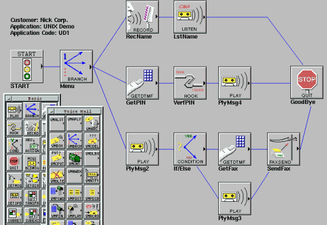
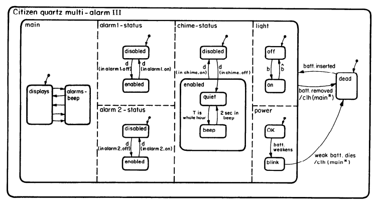
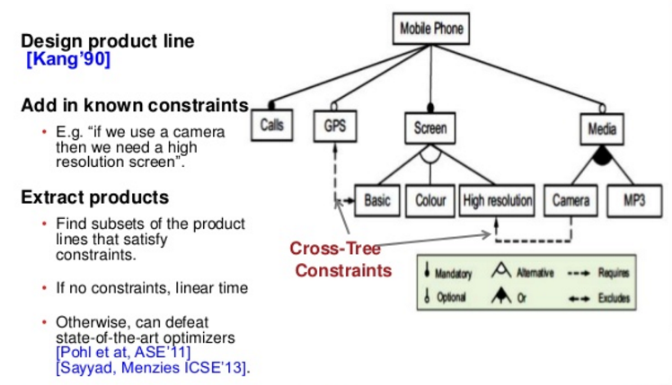
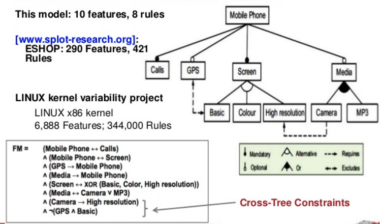
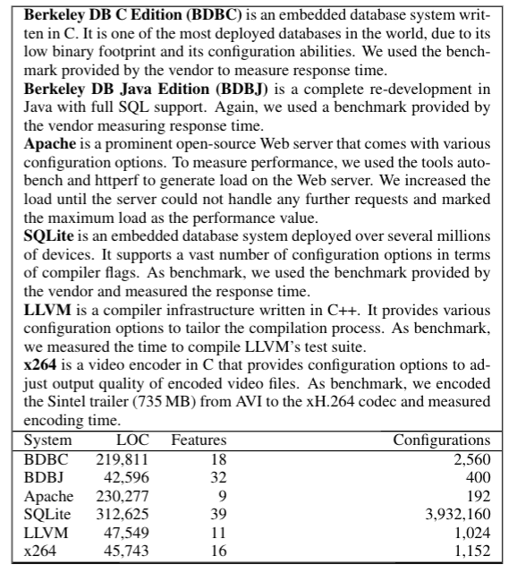
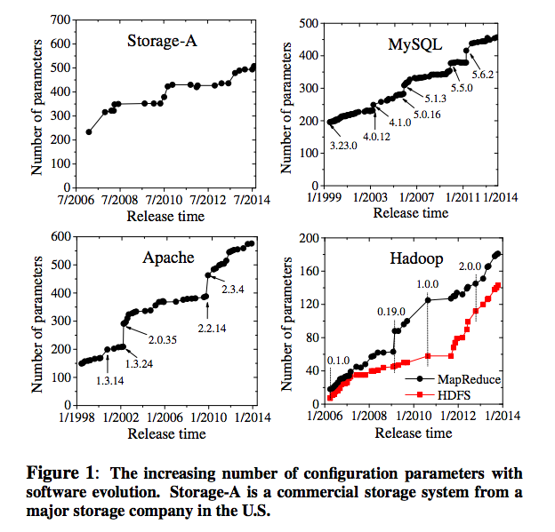
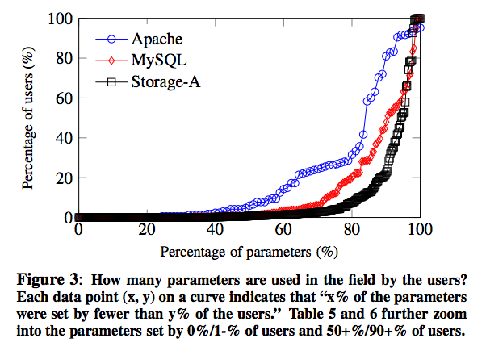
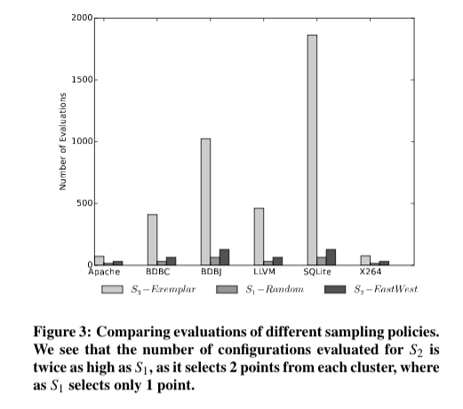

# Visual Notations for Programming


[TOC]

<br clear=all>
_____



The dream:

+ Fast deployment ideas to code
+ Some high-level notation where you quickly sketch some ideas, and then it all runs automatically.
+ <em>"Pictures are superior to texts in a sense that they are abstract, instantly
comprehensible, and universal."</em>
+ <em>"When we use visual expressions as a means of communication, there is
  no need to learn computer-specific concepts beforehand, resulting in a
  friendly computing environment which enables immediate access to computers
  even for computer non-specialists who pursue application."</em>

And the reality?

Lets see....

______

## Some Unusually Useful Diagrams

Some diagrams are actually accurate representations of underlying semantics

+ Harel state charts
+ ER diagrams
+ Compartmental Models.


### State charts: A Good Model?

One of the most cited papers in computer science:

+  David Harel, Statecharts: [A visual formalism for complex systems0](http://www.wisdom.weizmann.ac.il/~dharel/SCANNED.PAPERS/Statecharts.pdf). Science of Computer Programming, 8(3):231-274, June 1987.
+ 8625 citations (!!!)

Notation:

+ Black dot = state
+ Dashed lines: parallel work
+ Words on arcs: transition guards
+ Solid line: nested sub-state machines (and all transitions on super-states apply to sub-states



Directly translatable to executable code. 

_____

```c
int entry_state(void);
int foo_state(void);
int bar_state(void);
int exit_state(void);

/* array and enum below must be in sync! */
int (* state[])(void) = { entry_state, foo_state, bar_state, exit_state};
enum state_codes { entry, foo, bar, end};

enum ret_codes { ok, fail, repeat};
struct transition {
    enum state_codes src_state;
    enum ret_codes   ret_code;
    enum state_codes dst_state;
};
/* transitions from end state aren't needed */
struct transition state_transitions[] = {
    {entry, ok,     foo},
    {entry, fail,   end},
    {foo,   ok,     bar},
    {foo,   fail,   end},
    {foo,   repeat, foo},
    {bar,   ok,     end},
    {bar,   fail,   end},
    {bar,   repeat, foo}};

#define EXIT_STATE end
#define ENTRY_STATE entry

int main(int argc, char *argv[]) {
    enum state_codes cur_state = ENTRY_STATE;
    enum ret_codes rc;
    int (* state_fun)(void);

    for (;;) {
        state_fun = state[cur_state];
        rc = state_fun();
        if (EXIT_STATE == cur_state)
            break;
        cur_state = lookup_transitions(cur_state, rc);
    }

    return EXIT_SUCCESS;
}
```	
_____
```lua
function fsm0(t)
  local function maybe()    return math.random() > 0.5 end
  local function ok (w,a)   return maybe() end
  local function fail(w,a)  return maybe() end
  local function again(w,a) return maybe() end
  local entry = state(t,"entry")
  local foo   = state(t,"foo")
  local bar   = state(t,"bar")
  local stop  = state(t,"stop")
  trans(t,{
	       {entry, ok,     foo},
	       {entry, fail,   stop},
	       {foo,   ok,     bar},
	       {foo,   fail,   stop},
	       {foo,   again,  entry},
	       {bar,   ok,     stop},
	       {bar,   fail,   stop},
	       {bar,   again, foo}})
  return t
end

function state(t,name)
  local new = {name=name,out={}, visits=0}
  t[name] = new
  return new
end

function trans(t,arcs)
  for _,arc in pairs(arcs) do
    local out = t[arc[1].name].out
    out[#out + 1] = {from = arc[1], to=arc[3], gaurd=arc[2]}
end end

function shuffle( t )
  for i = #t, 2, -1 do
    local j = math.random(i)
    t[i], t[j] = t[j], t[i]
  end
  return t
end

function rseed() math.randomseed(tonumber(arg[1]) or 1) end

function run(t)
  rseed()
  local w,here = {},t["entry"]
  while true do
    print(here.name)
    here.visits = here.visits + 1
    if here.visits > 5 then return true end
    local arcs= t[here.name].out
    for _,arc in pairs( shuffle(arcs) ) do
      if arc.gaurd(w,arc) then
	here=arc.to
	break
end end end end

run(fsm0({}))
```

_____

Many tools from the formal verification community to prove properties across FSMs
      + WHich is very important for safety critical software

BUT:

+ hard to maintain unless auto-generated from some higher-level spec
+ hard to scale (all that detail! oh my!)
+ also, very low-level: hard to get that much information about all systems.
+ Cannot be used when interfacing to another black-box system you know nothing about
+ Irrelevant for the mash-up world (no knowledge of internals)

### ER Diagrams

Code changes all the time.

_ so don't document code, document the data it runs on.


Note for the above:

- Diagram that can be directly implemented in SQL tools (design straight to running code! hooray!)
- We've discussed before how this kind of ER modeling (and SQL) can actually slow up agile development
  (everybody start chanting NOSQL! NOSQL!)
- Also, Once the data is modeled this way, you still need to write the associated procedural code
  for GUIs, intricate business logic etc etc 

### Compartmental Models

Stocks, flows, stuff sloshing around some pipes. Simple, right?


Easy to code:

+ _Flows_ change stuff (and stuff is called _Stocks_).
+ _Stocks_ are real-valued variables , some entity that is accumulated over time by inflows and/or depleted by outflows.
+ To code a CM,
   + sum the  in and outflows around each stock;
   + multiply that by the time tick `dt`
   +  add the result back to the stock
   + e.g. `v.C += dt*(u.q - u.r)`


```
 q   +-----+  r  +-----+
---->|  C  |---->|  D  |--> s
 ^   +-----+     +-+---+
 |                 |
 +-----------------+ 

C = stock of clean diapers
D = stock of dirty diapers
q = inflow of clean diapers
r = flow of clean diapers to dirty diapers
s = out-flow of dirty diapers
```

This can ne modeled as one `have` methods that initializes:

+ `C,D` as a `Stock` with initial levels 100,0;
+ `q,r,s` as a `Flow` with initial rates of 0,8,0

and as a `step` method that  takes state `u`
and computes a new state `v` at
time `t+dt`.


```python
class Diapers(Model):

  def have(i):
    return o(C = S(100), D = S(0),
                q = F(0),  r = F(8), s = F(0))

  def step(i,dt,t,u,v):
    def saturday(x): return int(x) % 7 == 6
    v.C +=  dt*(u.q - u.r)
    v.D +=  dt*(u.r - u.s)
    v.q  =  70  if saturday(t) else 0 
    v.s  =  u.D if saturday(t) else 0
    if t == 27: # special case (the day i forget)
      v.s = 0
```


Note that the model is just some Python code so we can
introduce any shortcut function (e.g. `saturday`).

Can be used to model (e.g.) time-dependent business processes


Sounds great, right?

But when was the last time you coded anything that had a variable called _time_ in it?

Turns out, many (most) programming tasks are time-less. So CM is not applicable to general models.

________

## OO Notations


1980s, 1990s, 2000s, Lot of money in selling industrial design tools.

- To broaden market, unify design notations

In the age of agile, that kind of tool less fashionable.

- Its all about the code man

But one notation, somewhere, you are going to be asked to read/rewrite.

Welcome to UML, the unified modeling language.

- Its just a notation, not  a magic way to clarify design discussions
- Best to understand those obsessed with UML as suffering from "notation envy" from
  state charts, ER, etc


### UML Details

<a href="https://upload.wikimedia.org/wikipedia/commons/thumb/d/d1/OO_Modeling_languages_history.jpg/1024px-OO_Modeling_languages_history.jpg"></a>

<a href="../img/uml.pdf">Details</a>

Hints for writing small class diagrams:

+ Don't add gets/setters to class methods
+ If there is a relationship classX to classY, don't add relationship variables to X,Y. Instead connect them with a line and lable if with a line.
+ Also, consider writing fewer classes:


<iframe width="420" height="315" src="https://www.youtube.com/embed/o9pEzgHorH0" frameborder="0" allowfullscreen></iframe>


### Ulta-lightweight OO

If you like using only PARTS of UML: CRC cards


<iframe width="560" height="315" src="https://www.youtube.com/embed/5IpsMwxL37k" frameborder="0" allowfullscreen></iframe>


### UML Critique


This rest of this section from [Greg Wilson])http://neverworkintheory.org/2013/06/13/uml-in-practice-2.html)

Marian Petre: "UML in practice" ICSE'13, 2013. http://oro.open.ac.uk/35805/.

+ <em>UML has been described by some as "the lingua franca
of software engineering". Evidence from industry
does not necessarily support such endorsements. How
exactly is UML being used in industry — if it is?
This paper presents a corpus of interviews with 50
professional software engineers in 50 companies and
identifies 5 patterns of UML use.  </em>

he abstract for
this distinguished paper doesn't do it justice. Over
two years, the author interviewed over 50 developers
from a broad cross-section of industries and
countries. She found their use fell into five broad
categories:

```
Category	Number
no UML	        35
selective	    11
auto-code gen	 3
retrofit	     1
wholehearted	 0
```

Among the reasons given for not using it were:

- Lack of context: UML deals with architecture, rather than with the whole system.
- The overheads of understanding the notation.
- Issues of synchronization and consistency.

Perhaps the most interesting category is the second: those people who selectively use some elements of UML, but not the whole notation. Some of the partial uses identified were:

- UML as a 'thought tool'
- communicating with stakeholders
- collaborative dialogs
- adaptation (i.e., using a homegrown variant of the "real" notation), and
- selective traction (i.e., using it just as long as is useful, then moving on)

while the parts used were:

```
Diagram	           Number
Class diagrams	        7
Sequence diagrams 	    6
Activity diagrams	    6  
State machine diagrams	3
Use case diagrams	    1 
```

But there is much more in this paper than merely statistics. One of Petre's many insightful comments is:

+ <em> Responses concerning UML use tend to be polarized, between design use and implementation use... Despite the notional accommodation of the whole process, informants tend to use UML either in early design, or in implementation, rarely both (even when informants' roles include the whole process).</em>

There are two ways to react to this work.

+ The first is to read it as an indictment: after 20 years, UML is still mostly not used and not valued.
+ The second, and more hopeful, is as a concrete step toward improving it. Parts of UML are used; the more we learn about which ones, where, why, and how, the better our chances of building something better.


_________


## Case study: _model-itis_

The success of Harel state charts for some small safety-critical applications has lead
to a sad disease.

Definition: the obsessive and needless over-elaboration of descriptions of a system

+ Models become out of data, no one uses them
+ Time is wasted maintaining dull models.


### Case study of _model-itis_: options for software configuration:

+ Understanding options are important, especially when combining different systems.
+ Models of config options illustrate the strengths and weaknesses of models.

Background: Kang's feature maps:





Some real world feature maps (for software you might be using today): 



How many of those config options do people get:




But how many do they actually use:



And how many do they actually need:

- Current research at NCSU.
- Relevant options very small subset of total options
- Task: pick N, then 2N, then 4N, then 8N etc configurations till a data mining can take those N examples are generate a model withe less than 5% estimation error.
- Observation: with clever sampling methods (here called S1 and S2),
  N can be very very small:




Lessons:

1. Possible to reason from very lightweight descriptions (so do not waste time on needless
elaborations)
2. Within a system of N variables there are a small number  _M &ll; N_ variables that
actually matter.
3. So model a little, run a little, focus on the variables that actually matter.


## In summary


### Formal Studies

#### Gorshek et al 2014

On the use of software design models in software
development practice: an empirical investigation

+ Tony Gorschek, Ewan Tempero, and Lefteris Angelis. 2014. On the use of software design models in software development practice: An empirical investigation. J. Syst. Softw. 95 (September 2014), 176-193.

Summarizing the answers of 3785
developers answering the simple question on the extent to which design models
are used before coding

+ The use of models decreased with an increase in experience and increased with higher level of qualification.
+ Overall we found that models are used primarily as a communication and collaboration
mechanism where there is a need to solve problems and/or get a
joint understanding of the overall design in a group.
+ We also conclude that
models are seldom updated after initially created and are usually drawn on a
whiteboard or on paper.

#### Menzies 2000

Diagrams! Visual Programming! Great!

Great?

+ The good news
	   + Visual systems are more motivating for beginners than textual systems. 
       + In the case of _spatial reasoning problems_ (e.g. finding an "as the crow flies" path between
	     two points on a paper), a picture may indeed be worth 10,000
         words. Given some 2-D representation of a problem (e.g. an array representation),
         spatial reasoning can make certain inferences very cheaply. 
      + Also, ill-structured diagramming tools are a very useful tool for brainstorming
        ideas
+ The bad news:
	  + From  Menzies, Tim. ["Evaluation issues for visual programming languages."](https://goo.gl/XoqH5y)
       Handbook of Software Engineering and Knowledge Engineering 2 (1998): 93-101.
      + Many software engineering and knowledge engineering problems are not inherently
        spatial. 
      + Many visual programming systems do not support mucking around with ill-structured approach
        to brainstorming. 
      + Claims as to the efficacy of VP systems have been
        poorly documented. 

### Other Notes


+ Diagrams often over-elaborated with spurious detail (see case study at end on model-itis)
+ Diagramming can work well for small tasks but scale up is a problem
+ Writing diagrams can be slow
    + Getting all that detail
+ Diagrams are be completed (hooray!) and still miss important aspects of the system
    + LIke the whole design won't work cause of 	some networks scale issues
    + "Bubbles and arcs don't crash" -- Bertrand Meyer
+ Diagrams are incomplete and have to be augmented with other bits in (e.g.) a procedural language
      + e.g. while we have mature OO diagrams, notations for functional languages are .... missing
      + e.g. UML lets us describe one design... but what about all the multiple ideas of multiple stakeholders
	    and their incompatibilities?
      + High-level languages are getting very succinct. Why not jot down code in those direct?
+ Auto-translation rarely works without some tweaks
  to the auto-generated code... which has to be
  retweaked after each change to the high-level model
+ In the age of the mash up,  here's a real killer:
       + Even if you found a perfect way to diagram _your_ system, as soon as your code
         becomes a small part of a large mass-up then your diagrams become a great summary of a teeny-tiny part
		 of the whole system.
	    -  In the land of the app, have to model functionality etc. Also, with RESTFUL interfaces,
who cares about the internals? Its just the interface man!
+ And in the age of agile, an obsession with complex documents and diagrams is not popular.


